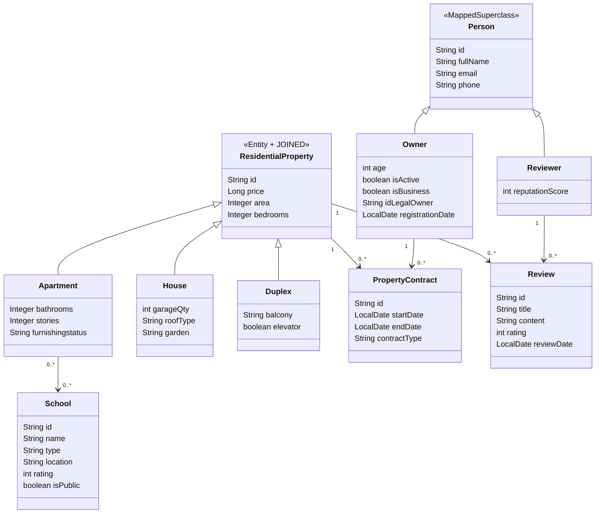

# LAB02 — Domain Model Definition

## 1. Product Goal

### Objective

Design and implement a clean, domain-driven backend model for a residential property management system using:

- Spring Boot
- Spring Data JPA
- H2 in-memory database
- JOINED inheritance strategy
- Contract-based ownership modeling

---

## 2. Problem Statement

The backend models a residential real estate domain where:

- Properties can be Apartments, Houses, or Duplexes.
- Owners manage properties through formal contracts.
- Reviewers evaluate properties.
- Apartments may be associated with nearby schools.
- The database must be automatically populated through an orchestrated process.

The system must ensure:

- Clear inheritance modeling
- Proper ownership abstraction
- Referential integrity
- Clean separation of concerns
- Structured population workflow

---

## 3. Core Architectural Decisions

### 3.1 Inheritance Strategy

ResidentialProperty uses:

This ensures:

- Normalized database structure
- Shared base attributes stored once
- Subclass-specific tables for Apartment, House, and Duplex

---

### 3.2 Ownership Modeling (DDD Clean Model)

There is NO direct owner_id in ResidentialProperty.

Ownership is modeled through PropertyContract:

Owner 1 — 0.._ PropertyContract  
ResidentialProperty 1 — 0.._ PropertyContract

This allows:

- Historical tracking of ownership
- Domain consistency
- Avoiding duplicated ownership logic

---

### 3.3 Review System

- A Review belongs to one ResidentialProperty.
- A Reviewer may write multiple Reviews.

---

### 3.4 School Association

- Apartment and School are related via Many-to-Many.
- Only Apartment supports school associations.

---

## 4. UML Class Diagram (Mermaid)

