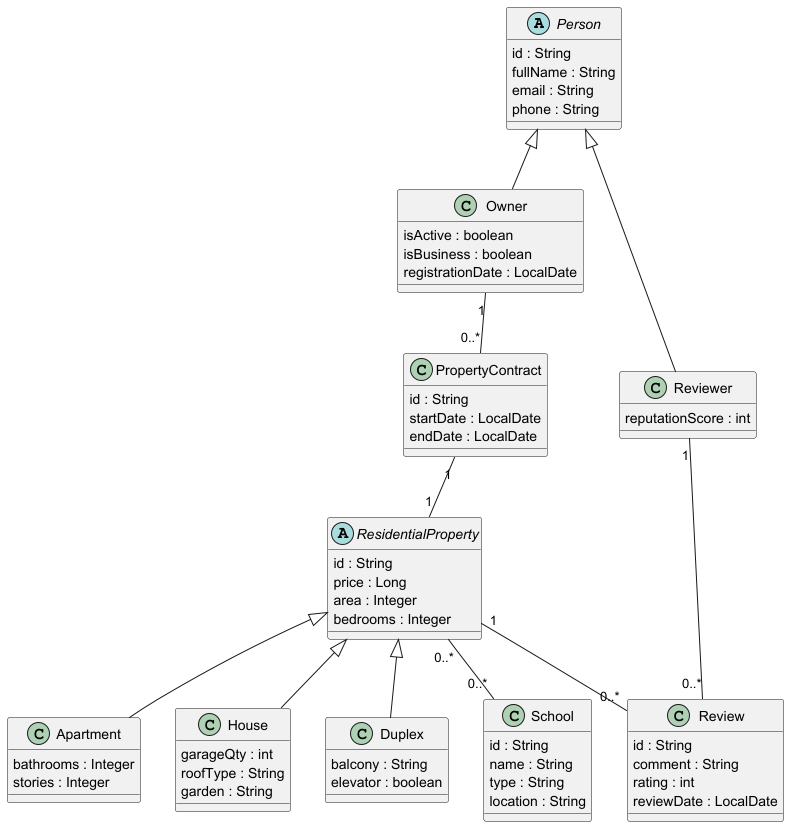

# LAB#02 — ApartmentPredictor Backend Architecture

## UML Class Diagram




## 1️⃣ Product Goal

The objective of this laboratory is to extend the ApartmentPredictor backend by introducing a structured object-oriented domain model with inheritance, entity relationships, and database persistence using Spring Boot and JPA.

The system models:

- A **Person hierarchy** (Owner, Reviewer)
- A **ResidentialProperty hierarchy** (Apartment, House, Duplex)
- A contract bridge entity (**PropertyContract**)
- A review system
- A Many-to-Many relationship with schools
- H2 in-memory persistence with automatic population

This lab reinforces advanced OOP modeling, relational mapping, and REST API design.

---

## 2️⃣ Inheritance Strategy Decision

For the `ResidentialProperty` hierarchy (Apartment, House, Duplex) we selected:

```java

@Inheritance(strategy = InheritanceType.JOINED)


  
